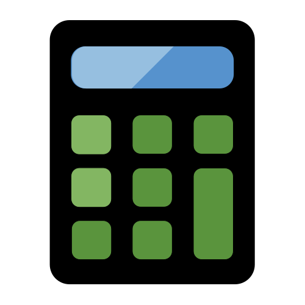

# coc-calc

<p align="center">
  
  <br>
  <a href="https://travis-ci.com/weirongxu/coc-calc">
    
  </a>
  <br>
  Calculate extension for coc.nvim
</p>

## Features

- Support underscores in numbers `10_000_000`
- Support bignumber, use [decimal.js](https://github.com/MikeMcl/decimal.js)
- Suppoort [Mathematics functions](http://mikemcl.github.io/decimal.js/#methods)


## Usage

1. Install by coc.nvim command:
   ```
   :CocInstall coc-calc
   ```
2. Input calculate expression in any buffer
   ```
   sin(PI / 2) =
   ```

## Keymaps

Create keymappings like:

```vim
" append result on current expression
nmap <Leader>ca <Plug>(coc-calc-result-append)
" replace result on current expression
nmap <Leader>cr <Plug>(coc-calc-result-replace)
```

## Configurations

- `calc.priority`, calc priority, default: `1000`
- `calc.highlight`, enable calc highlight, default: `true`
- `calc.replaceOriginalExpression`, enable relace original expression, default: `true`

## Operators

Precedence is from highest to lowest.

| Operator                              | Example                                     |
| ------------------------------------- | ------------------------------------------- |
| exponentiation `**`                   | `4 ** 3 ** 2` equivalent to `4 ** (3 ** 2)` |
| unary `+ -`                           | `-2` `+2`                                   |
| multiply / divide / remainder `* / %` | `4 % 3` `4 * 3`                             |
| addition / subtraction                | `.2 - .1` `.1 + .2`                         |

## Mathematics Constant

- `E`
- `PI`

## Mathematics Functions

```
abs, acos, acosh, add, asin,
asinh, atan, atanh, atan2, cbrt
ceil, cos, cosh, div, exp,
floor, hypot, ln, log, log2,
log10, max, min, mod, mul,
pow, random, round, sign, sin,
sinh, sqrt, sub, tan, tanh, trunc
```

Details: http://mikemcl.github.io/decimal.js/#methods

## License

MIT
